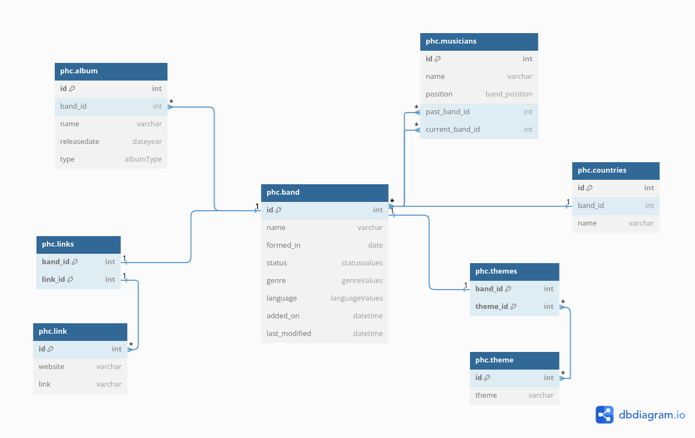

A small webapi for me to store information about bands I like listening to.

## Relational Schema:

NOTE: The schema may change to conform to denormalisation forms in the future.

The database schema was made using dbdiagram.io.



The following enums are used in the schema:

```phc.statusValues``` represent the status of the band. This is used in the ```phc.band``` relation.

```
enum phc.statusValues{
  active
  on_hold
  broke_up
}
```

```phc.band_position``` represent the position that each band member can be, and is used in the relation ```phc.musicians```.

```
enum phc.band_position{
  guitarist
  bassist
  drummer
}
```

```phc.languageValues``` holds the languages that the band perform in. This is used in the ```phc.band``` relation.

```
enum phc.languageValues{
  English
  Japanese
}
```

```phc.albumType``` represents the type of album. This is used in the ```phc.album``` relationn.

```
enum phc.albumType{
  EP
  FullLength
  Singles
}
```
